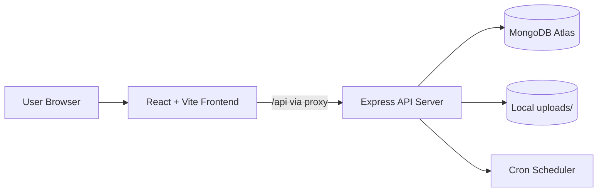

# Fleet Manager

[](LICENSE)

Fleet Manager is a full-stack web application for managing fleet vehicles, maintenance work, and compliance documents with role-based access for Admin and Mechanic users.

## Overview

This project helps fleet teams:

- Register and manage vehicle assets.
- Assign and track maintenance tasks.
- Monitor compliance documents (registration and DOT inspection).
- Export operational data to Excel for reporting.
- Generate vehicle QR codes for quick mechanic access workflows.

## Key Features

### Authentication and Roles

- Session-based authentication using `express-session`.
- Admin login with password protection.
- Mechanic login with restricted workspace access.
- Role-based API guard middleware for protected routes.

### Admin Dashboard

- Add, view, update, and delete vehicles.
- Set and update vehicle operational status.
- Upload and manage compliance documents.
- Assign maintenance tasks to mechanics.
- View per-vehicle maintenance history.
- Export fleet asset data to Excel (`.xlsx`).
- View live fleet analytics cards:
  - Total vehicles
  - Active vehicles
  - Pending jobs

### Mechanic Portal

- View pending and completed tasks.
- Mark tasks as completed.
- Export maintenance logs to Excel (`.xlsx`).

### Compliance Center

- Upload required compliance files:
  - Copy of Registration
  - Annual DOT Inspection
- Track expiration dates.
- Show automated alert states:
  - Missing
  - Expired
  - Expiring soon (within 30 days)
  - Current

### Automation

- Daily cron job creates automated PM tasks for active vehicles.

## Tech Stack

### Frontend

- React 19
- Vite
- Lucide React icons
- Sheet export with `xlsx`
- QR generation with `qrcode.react`

### Backend

- Node.js
- Express 5
- MongoDB with Mongoose
- Session management with `express-session`
- File uploads with `multer`
- Scheduled jobs with `node-cron`
- Environment variable loading with `dotenv`

## Architecture



## Project Structure

```text
fleet-manager/
  server.js
  package.json
  .env
  .env.example
  frontend/
    src/
      components/
    package.json
    vite.config.js
  uploads/
```

## Getting Started

### 1. Prerequisites

- Node.js 18+ recommended
- npm
- MongoDB Atlas connection string

### 2. Install Dependencies

From the project root:

```bash
npm install
```

From the frontend folder:

```bash
cd frontend
npm install
```

### 3. Configure Environment Variables

In root `.env`:

```env
ADMIN_PASSWORD=your-admin-password
SESSION_SECRET=your-session-secret
MONGO_URI=your-mongodb-connection-string
```

### 4. Run the App

Start backend (from root):

```bash
node server.js
```

Start frontend (new terminal):

```bash
cd frontend
npm run dev
```

Open the frontend URL shown by Vite (typically `http://localhost:5173`).

## API Summary

### Auth

- `POST /api/auth/login`
- `GET /api/auth/session`
- `POST /api/auth/logout`

### Vehicles

- `POST /api/vehicles` (Admin)
- `GET /api/vehicles` (Admin/Mechanic)
- `GET /api/vehicles/:id` (Admin/Mechanic)
- `PATCH /api/vehicles/:id` (Admin)
- `DELETE /api/vehicles/:id` (Admin)

### Documents

- `POST /api/vehicles/:vehicleId/documents` (Admin)
- `POST /api/vehicles/:vehicleId/compliance-documents` (Admin)
- `GET /api/vehicles/:vehicleId/compliance-documents` (Admin/Mechanic)

### Tasks

- `POST /api/tasks` (Admin)
- `GET /api/tasks` (Admin/Mechanic)
- `PATCH /api/tasks/:taskId` (Admin/Mechanic)
- `GET /api/vehicles/:vehicleId/tasks` (Admin/Mechanic)

## Challenges Solved

- Unified role-based access across frontend and backend route behavior.
- Normalized vehicle identifier handling (`vehicleNumber`, legacy aliases).
- Implemented compliance status logic based on date windows and missing docs.
- Coordinated file upload flow and metadata persistence in MongoDB.
- Added scheduled preventive maintenance generation with cron.
- Added environment-based configuration to avoid hardcoding sensitive values.

## Known Limitations

- Admin password is currently compared in plaintext from env (not hashed in DB).
- No automated test suite yet.
- Upload storage is local filesystem and not cloud/object storage.
- Session cookie is configured for local development (`secure: false`).

## Roadmap

- Hash and verify admin credentials with bcrypt.
- Move authentication to persisted user accounts with roles.
- Add unit and integration tests.
- Add pagination/filtering for large fleets.
- Store uploads in cloud storage and add signed URL access.
- Add CI workflow for lint/build/test checks.

## Security Notes

- Keep `.env` out of version control.
- Rotate `SESSION_SECRET` and `ADMIN_PASSWORD` regularly.
- Restrict MongoDB Atlas network and user permissions.
- Use HTTPS and secure cookies in production.

## License

This project is licensed under the Apache License 2.0. See [LICENSE](LICENSE) for details.

---

© 2025 Fleet Asset Tracking. All rights reserved.
